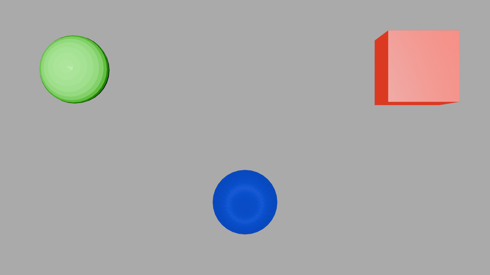

<!-- Improved compatibility of back to top link: See: https://github.com/othneildrew/Best-README-Template/pull/73 -->
<a name="readme-top"></a>
<!--
*** Thanks for checking out the Best-README-Template. If you have a suggestion
*** that would make this better, please fork the repo and create a pull request
*** or simply open an issue with the tag "enhancement".
*** Don't forget to give the project a star!
*** Thanks again! Now go create something AMAZING! :D
-->


<!-- PROJECT SHIELDS -->
<!--
*** I'm using markdown "reference style" links for readability.
*** Reference links are enclosed in brackets [ ] instead of parentheses ( ).
*** See the bottom of this document for the declaration of the reference variables
*** for contributors-url, forks-url, etc. This is an optional, concise syntax you may use.
*** https://www.markdownguide.org/basic-syntax/#reference-style-links
-->

<div align="center">

[![MIT License][license-shield]][license-url]
[![reposize][reposize-shield]][reposize-url]

[![LinkedIn][linkedin-shield]][linkedin-url]
[![portfolio][portfolio-shield]][portfolio-url]

</div>

<h1 align="center">Blender as a Python Module in Docker</h1>

<p align="center">


</p>


---

**Table of Contents**

- [About](#about)
- [Requirements](#requirements)
- [Tested On](#tested-on)
- [Instructions to Build Docker Image](#instructions-to-build-docker-image)
- [Running Docker Container](#running-docker-container)
- [Examples](#examples)
  - [Simple Render](#simple-render)
  - [Multi File Renders](#multi-file-renders)
  - [Compositing](#compositing)
  - [Compositing Animated](#compositing-animated)
- [TODO](#todo)
- [License](#license)
- [Contact](#contact)
- [RESOURCES](#resources)

---


## About

Blender can be setup as [Python module](https://docs.blender.org/api/current/info_advanced_blender_as_bpy.html) in a headless environment. This makes it easier for developers to program renders without the need for an interactive GUI session.

This repository provides a step by step guide to set up Blender as Python module in Docker and carry out renders using NVIDIA GPUs and their frameworks CUDA and [OptiX](https://developer.nvidia.com/rtx/ray-tracing/optix).

## Requirements

- Linux based OS
- NVIDIA RTX GPUs
- NVIDIA drivers
- [Docker](https://docs.docker.com/engine/install/)
- [NVIDIA Container Toolkit](https://www.gravee.dev/en/setup-nvidia-gpu-for-docker/#Install-Nvidia-Container-Toolkit)
- At-least 16 GB of storage

## Tested On

- Ubuntu 20.04
- NVIDIA GeForce RTX 3070 Ti
- Driver Version: 555.58.02
- Docker version 27.5.1
- Blender 4.3
- Python 3.11

## Instructions to Build Docker Image

Follow these instructions to build Docker image after cloning repository

1. Download OptiX SDK OptiX from [here](https://developer.nvidia.com/designworks/optix/download). You will need to signup for a NVIDIA account (Google account) and join their developer program.
2. Extract SDK and save into this directory. Note the name of the OptiX SDK folder.
3. Take note of build parameters (if required)

Build Parameter | Description | Typical Value
---------|----------|---------
 BLENDER_BRANCH | Desired Blender branch from [repo](https://projects.blender.org/blender/blender.git) | "v4.3.2"
 BLENDER_VERSION_MAIN | Main version of choosen Blender branch | 4.3
 PYTHON_VERSION | Python version of choosen Blender Branch (check Blender documentation for compatability) | 3.11
 OPTIX_DIR_NAME | Name of extracted OptiX SDK folder | "NVIDIA-OptiX-SDK-8.0.0-linux64-x86_64"

4. Build initial image using the following command in a terminal

```bash
# no build commands
docker build  -t blender-module .

# all build commands
docker build --build-arg BLENDER_BRANCH=v4.3.2 --build-arg BLENDER_VERSION_MAIN=4.3 --build-arg PYTHON_VERSION=3.11 --build-arg OPTIX_DIR_NAME="NVIDIA-OptiX-SDK-8.0.0-linux64-x86_64" -t blender-module .
```
*NOTE: This make take some time. Image is approximately 16 GB*

5. Run Docker container using the following command in a terminal
   
```bash
docker run -it --rm --network host -e NVIDIA_DRIVER_CAPABILITIES=graphics,compute,utility  --runtime=nvidia --gpus all  --name blender_module --volume $(pwd):/workspace blender-module
```

6. Run a render using the Python script `simple_cube.py'. You will use this script to get the appropriate command to build Cycles CUDA kernel which will need to be copied to the Dockerfile
   
```bash
python3 examples/multi_file_render.py
```
7. You will see a message in your terminal as follows:


> Compiling CUDA kernel ...
"nvcc" -arch=compute_86 --ptx "/blender_dir/build_linux_bpy/bin/bpy/4.3/scripts/addons_core/cycles/source/kernel/device/optix/kernel.cu" -o "/root/.cache/cycles/kernels/cycles_kernel_compute_86_72F9B7E397DBBBD07FF7F6F1785B3326.ptx" -m64 --ptxas-options="-v" --use_fast_math -DNVCC -I"/blender_dir/build_linux_bpy/bin/bpy/4.3/scripts/addons_core/cycles/source" -DWITH_NANOVDB -I"/optix/include"

Copy the command from `"nvcc"` line. Example as follows:
> "nvcc" -arch=compute_86 --ptx "/blender_dir/build_linux_bpy/bin/bpy/4.3/scripts/addons_core/cycles/source/kernel/device/optix/kernel.cu" -o "/root/.cache/cycles/kernels/cycles_kernel_compute_86_72F9B7E397DBBBD07FF7F6F1785B3326.ptx" -m64 --ptxas-options="-v" --use_fast_math -DNVCC -I"/blender_dir/build_linux_bpy/bin/bpy/4.3/scripts/addons_core/cycles/source" -DWITH_NANOVDB -I"/optix/include"

*NOTE: Your command should look slightly different*

8. Paste the command into **line 131** of the `Dockerfile`. Do not edit any other lines.
9. Build the image again:

```bash
# no build commands
docker build  -t blender-module .

# all build commands
docker build --build-arg BLENDER_BRANCH=v4.3.2 --build-arg BLENDER_VERSION_MAIN=4.3 --build-arg PYTHON_VERSION=3.11 --build-arg OPTIX_DIR_NAME="NVIDIA-OptiX-SDK-8.0.0-linux64-x86_64" -t blender-module .
```

## Running Docker Container

Run Docker container using the following command in a terminal
   
```bash
docker run -it --rm --network host -e NVIDIA_DRIVER_CAPABILITIES=graphics,compute,utility  --runtime=nvidia --gpus all  --name blender_module --volume $(pwd):/workspace blender-module
```

This will give the container network access through `--network host`flag. The --gpus flag allows GPU access, which is necessary to run Blender on a GPU. The `--volume $(pwd):/workspace` binds the current directory to `/workspace` inside the container. This way you can work in your local directory but have all files accessible within the Docker container.

## Examples

These examples all use GPU rendering with OptiX.

### Simple Render

Plain simple render of a purple cube at a frontal view.

```bash
python3 examples/simple_render.py
```

<p align="center">


</p>


### Multi File Renders

This example renders three scenes, each containing a different object, and saves the rendered images as separate files.

<p align="center">


</p>

```bash
python3 examples/multi_file_render.py
```

### Compositing

This example renders three scenes, each containing a different object, and composites them together. It also saves a BLEND file and renders that as well. Expect two images which should be exactly the same as the one below.

```bash
python3 examples/compositing.py
```
<p align="center">

</p>

### Compositing Animated
This example renders three scenes, each containing a different object, composites them together, and renders multiple frames by randomly moving the objects. Expect rendered images saved to directory called `animation_example` and a MP4 of the images using [imageio](https://imageio.readthedocs.io/en/stable/).

```bash
python3 examples/compositing_animated.py
```

<p align="center">

</p>


## TODO

- [ ] Figure out a way to build Cycles CUDA kernel during first container build
- [ ] Reduce image size using multi-stage build and runtime packages

<p align="right">(<a href="#readme-top">back to top</a>)</p>

## License

Distributed under the MIT License. See `LICENSE.txt` for more information.

<p align="right">(<a href="#readme-top">back to top</a>)</p>

## Contact

[Jasprabhjit Mehami](linkedin-url)

Email: jasprabhjit.mehami@gmail.com

<p align="right">(<a href="#readme-top">back to top</a>)</p>

<!-- ACKNOWLEDGMENTS -->

## RESOURCES

* https://blender.stackexchange.com/questions/247436/blender-as-python-module-in-docker-container-how-to-build-cuda-kernels-only-onc

  

<p align="right">(<a href="#readme-top">back to top</a>)</p>

<!-- MARKDOWN LINKS & IMAGES -->
<!-- https://www.markdownguide.org/basic-syntax/#reference-style-links -->


[contributors-shield]: https://img.shields.io/github/contributors/jmehami1/blender-as-python-module-docker.svg?style=plastic&logo=appveyor
[contributors-url]: https://github.com/jmehami1/blender-as-python-module-docker/graphs/contributors
[forks-shield]: https://img.shields.io/github/forks/jmehami1/blender-as-python-module-docker.svg?style=plastic&logo=appveyor
[forks-url]: https://github.com/jmehami1/blender-as-python-module-docker/network/members
[stars-shield]: https://img.shields.io/github/stars/jmehami1/blender-as-python-module-docker.svg?style=plastic&logo=appveyor
[stars-url]: https://github.com/jmehami1/blender-as-python-module-docker/stargazers
[issues-shield]: https://img.shields.io/github/issues/jmehami1/blender-as-python-module-docker.svg?style=plastic&logo=appveyor
[issues-url]: https://github.com/jmehami1/blender-as-python-module-docker/issues

[license-shield]: https://img.shields.io/github/license/jmehami1/blender-as-python-module-docker
[license-url]: https://github.com/jmehami1/blender-as-python-module-docker/blob/master/LICENSE.txt
[reposize-shield]: https://img.shields.io/github/repo-size/jmehami1/blender-as-python-module-docker.svg?style=plastic&logo=appveyor
[reposize-url]: https://github.com/jmehami1/blender-as-python-module-docker


[linkedin-shield]: https://img.shields.io/badge/-LinkedIn-blue.svg?style=for-the-badge&logo=linkedin&colorB=0077b5
[linkedin-url]: https://linkedin.com/in/jessemehami
[portfolio-shield]: https://img.shields.io/badge/-Portfolio-blue.svg?style=for-the-badge&logo=Portfolio&colorB=625094
[portfolio-url]: https://jmehami1.github.io/
